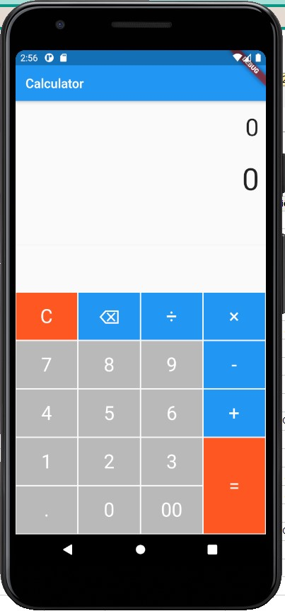
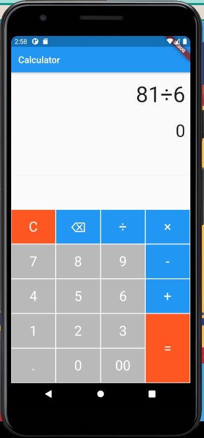
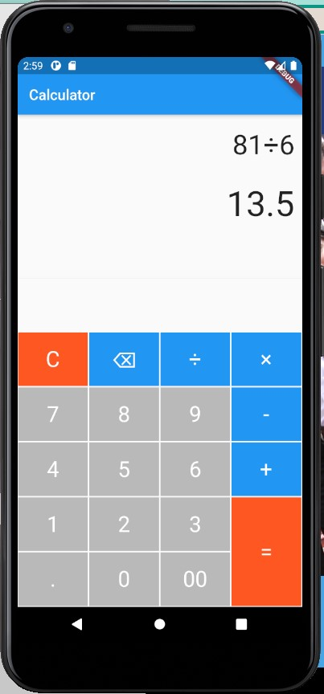

# Ứng dụng máy tính đơn giản

- Có khả năng làm các phép tính cộng, trừ, nhân, chia.
- Xóa các số và xóa kết quả tính toán.

## Thông tin

Tên: Hoàng Văn Hiếu
ID: 17021244

## Cách cài đặt
- Clone project về.
- Sử dụng Android Studio để build app từ dart code.
- Chạy trên máy ảo hoặc điện thoại.

## Ảnh chụp màn hình

  
